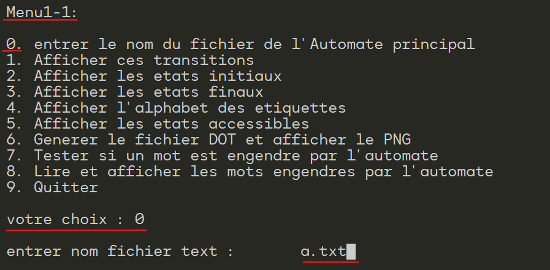
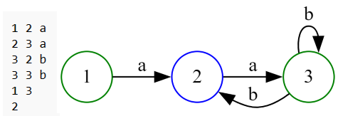

## Automata Theory Project

This project implements a finite automaton (FA) in C and demonstrates core concepts from automata theory.

### Features

- **Automaton Representation**: Reads and stores automata information (transitions, initial states, final states) from text files.
- **Visualization**:
  - Displays transitions, initial states, and final states.
  - Generates DOT files for visualization using Graphviz.
- **Automaton Operations**:
  - **Union**: Constructs a new automaton representing the union of two automata.
  - **Product**: Calculates the product of two automata.
  - **Kleene Star (Etoile)**: Generates a new automaton representing the Kleene closure of an automaton.
  - **Epsilon Removal**: Constructs a new automaton without epsilon transitions.
  - **Word Testing**: Determines if a given word is accepted by the automaton.
  - **Word Generation**: Reads a list of words from a file and tests if they are accepted by the automaton.

### Getting Started

#### Clone the Repository:

```bash
git clone https://github.com/mouadd9/automaton_project.git
```
#### Compile:

```bash
gcc automate.c -o automate 
```
#### Run:

```bash
./automate
```
### Usage

- Follow the interactive menu prompts to select operations.
- **IMPORTANT:** Before any operations, choose option 0 in Menu1-1 to provide the name of the text file containing your automaton definition.
- Text files should adhere to a specific format (example provided below).



#### Example Text File Format (a.txt):
```
1 2 a
2 3 a
3 2 b
3 3 b
1 3
2
```


- Lines 1...n: Transitions in the format start_state end_state symbol.
- Following Line: Initial state(s), space-separated
- Final Line: Final state(s), space-separated

#### Visualizing Automata

- Ensure Graphviz is installed ([Graphviz](https://graphviz.org/))
- DOT files generated by the project can be rendered:
  ```bash
  dot -Tpng Automate.dot -o Automate.png
  ```
  
  
  
#### Project Structure

- `automate.c`: Core implementation.
- `*.txt`: Automaton text files.
- `mots.txt`: Word lists.
- `images`: Output visualizations.

### Contributing

- Feel free to submit pull requests for bug fixes, improvements, or additional features.

### Future Enhancements

- Implement determinization of FAs.


